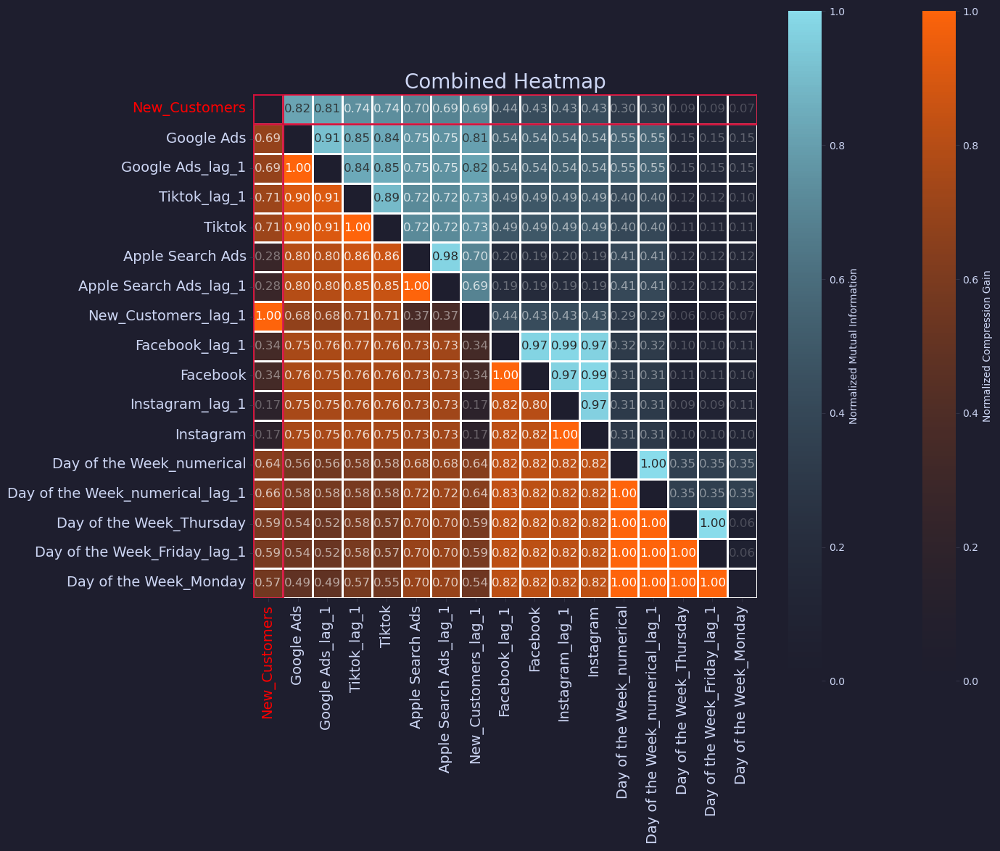

# Mutual Information Matrix and Heatmap for Feature Filtering

## Introduction

This project showcases a tool designed to facilitate enhanced feature filtering techniques grounded in information theory. By utilizing a mock dataset, found in marketing_causality.csv, which simulates the dynamics of marketing spending in various channels versus the number of new users acquired, we demonstrate the functionalities of the tool in a controlled environment.

The central feature of this project is a mutual information matrix heatmap that represents various information theoretic metrics - mutual information, normalized compression gain in the upper triangle, and correlation coefficients in the lower triangle. This representation aims to underscore the limitations of traditional correlation metrics for feature filtering tasks and exhibit how mutual information and normalized compression gain can provide a more nuanced understanding.

This tool also offers the ability to automatically transform categorical features and incorporate continuous variables with specified lags, further aiding in detailed analysis. The visualization is streamlined, focusing only on the 'k' most pertinent variables in terms of mutual information against the selected variable, thereby offering clarity and precision in the representation.



## Features

1. **Automated Transformation of Categorical Features**: The script automatically identifies and transforms categorical features into a format suitable for analysis.
2. **Support for Lagged Variables**: The ability to include lagged variables specified by a list of lags to analyse the time-delayed effects.
3. **Top K Features Selection**: Automatically selects the top K most important variables based on their mutual information with the target variable.
4. **Normalized Compression Gain Calculation**: The tool can now compute the normalized compression gain between two variables, providing insights into the redundancy and synergy between features.
5. **Heatmap Visualization**: Generates a heatmap where the upper diagonal represents mutual information or normalized compression gain and the bottom diagonal represents the correlation matrix.

## Getting Started

### Requirements

Ensure to install the necessary packages listed in the `requirements.txt` file using the following command:

```bash
pip install -r requirements.txt
```

### Usage

1.  Import the necessary modules.
2.  Read the `marketing_causality.csv` dataset.
3.  Use the `plot_combined_heatmap` function to visualize the combined heatmap.

#### heatmat.ipynb

In this notebook, you can find an example of how to use the `plot_combined_heatmap` function with a test dataset.

## License

This project is licensed under the terms of the MIT license.

## Acknowledgements

Special thanks to the creators of the `catppuccin-matplotlib` package, which was used for enhancing the aesthetics of the heatmap visualization.

## Contact

For any queries or further clarification, please contact (your contact information).